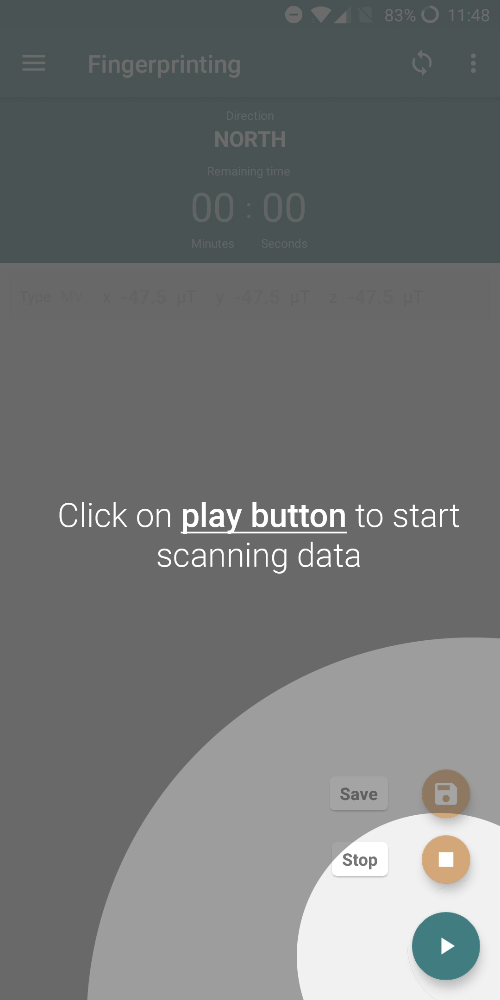
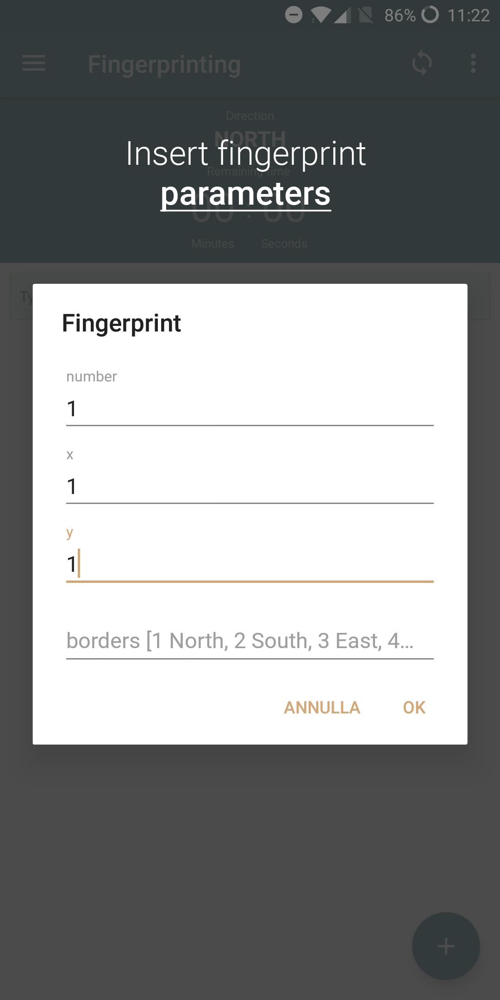
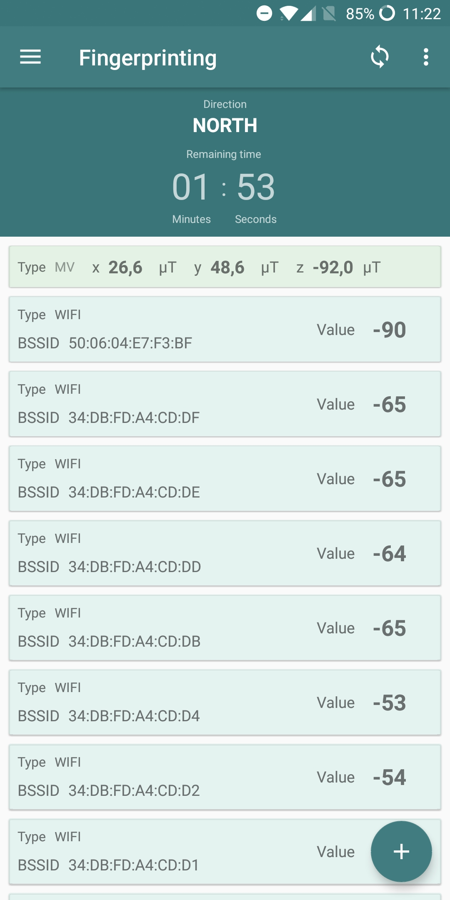
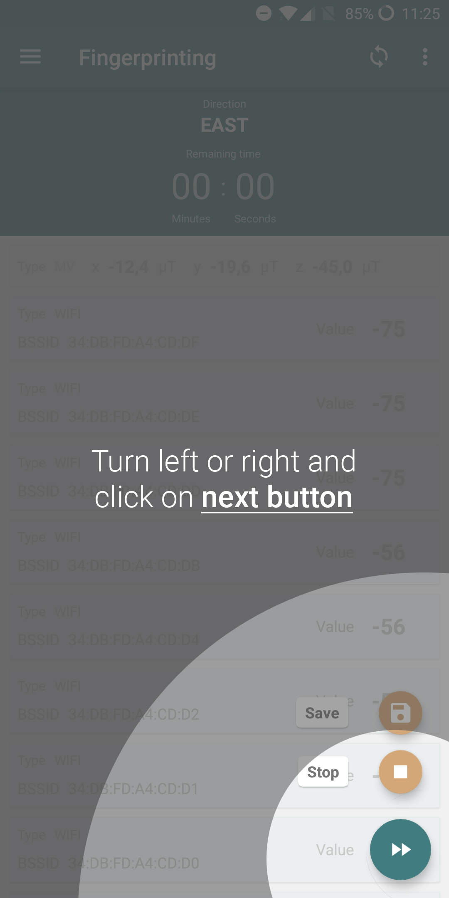
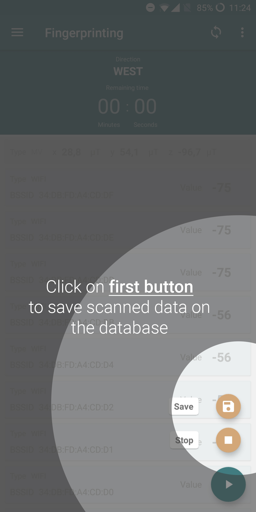
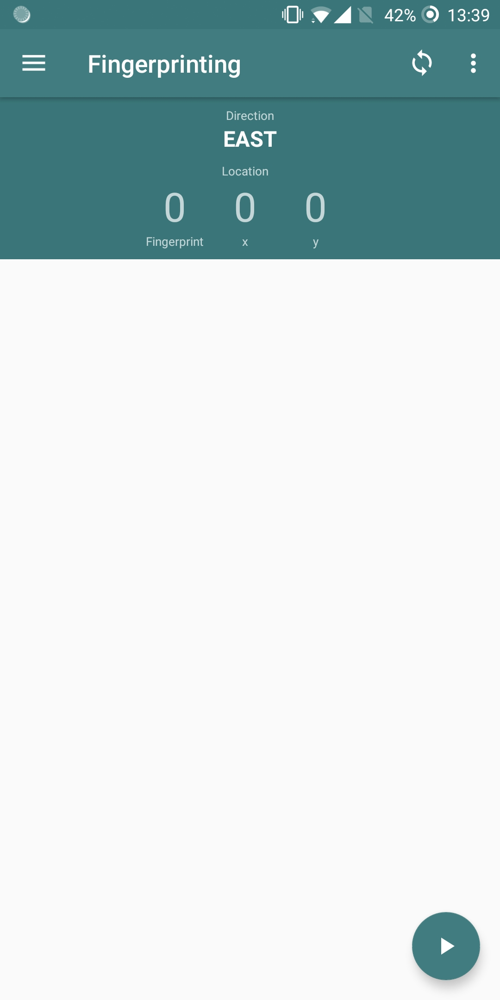
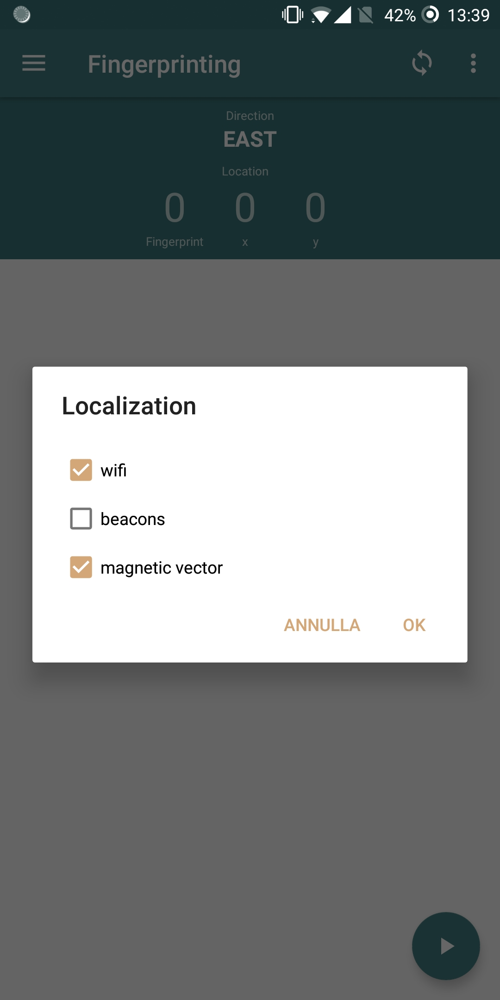
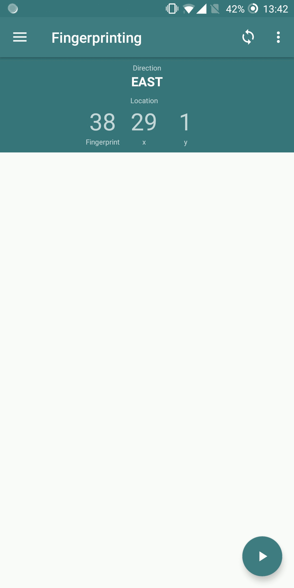

# Fingerprinting (Android application)

This repository contains an Android application than can be used to build an indoor localization 
system.

## CouchDB server setup
First, you need to install and configure your own instance of CouchDB on a remote computer/server.

Follow CouchDB official instructions [here](docs.couchdb.org/en/latest/install/unix.html
) and make sure to let CouchDB listen any available IP address, using:

```
[chttpd]
bind_address = 0.0.0.0
```

in the configuration file (`server_ip:5984/_utils/`, *Configuration* tab on the left menu).

## Python server setup
Follow the instructions [here](https://github.com/vladbragoi/fingerprinting_server) for configuring 
and starting the server application.

## Application setup
Fisrt, Download and install the Android application, then start it, allow permissions and open the 
*Settings* menu on the right.
Here you need to specify:
* Your name
* The Fingerprinting database parameters:
  * Database Name
  * Database URL (that needs to coincide with your remote computer/server, and need to be in the 
  form of `http://server_ip:5984/`)
  * Database Username (generally `admin`, but for better security follow 
  [these](http://docs.couchdb.org/en/stable/intro/security.html?highlight=user) instructions)
  * Database Password
* The Localization database parameters:
  * Database Name (that need to be different from the fingerprinting database name)
  * Database URL (that could be the same ip of the fingerprinting database)
  * Database Username (same as above)
  * Database Password
 
 *Note that the Debug option should be disabled or it will work only with access points of the 
 University of Verona*
 
 ## Application usage
 ### Fingerprinting phase
1. Launch the application (eventually set parameters as indicated above) and press the *Start* 
button:

 
2. Start positioning on the center of the first reference point (RP) defined in your environment (remember
to subdivide the area in reference points of the same side length before starting). 
 
3. Choose the data type you want to scan (if wifi or beacon signals) and insert the scan period you
want to collect data in the specific reference point selected and in the specific cardinal direction
you are oriented to.
 
4. Insert RP's parameters, such as number*, x*, y* and borders. Elements marked with * are required.

 
5. When you press `OK` the application will start scanning, so you should stay freeze until the timer
will finish.

 
6. Change your direction turning left or right and press the *Plus* button and then the 
*double-arrow* one to repeat the scan values on the new direction.

 
7. Repeat the step 6 in all of the 4 cardinal direction and when you have done, remember to
save scanned data to the local db (tabbing the *Save* button), which will automatically be 
synchronized with the remote CouchDB configured as explained above.


### Localization Phase
Make sure the server application is running on the remote computer/server 
(see [server](https://github.com/vladbragoi/fingerprinting_server) for details).

1. Launch the application and move to "Localization" tab (swipe left to right to see the menu).

2. Press on the *Start* button for starting the localization.


3. Select the data type to scan: wifi or beacon signals and press the *OK* button.


4. Move in the area and see how values changes

