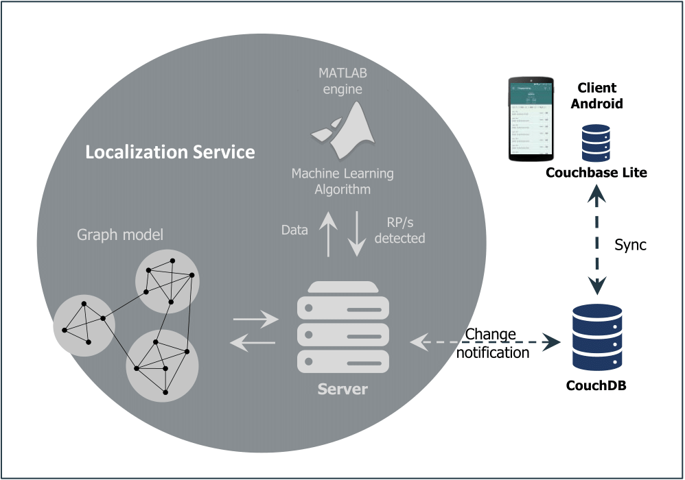

# indoor_localization_system
This repository contains the source-code for an indoor localization system:

* `android_application` folder contains the source-code for an Android app that can be used to collect data in order to create your oun fingerprinting dataset, based on RSSI (WiFi access points/Bluetooth BLE beacons)and Magnetic Field, for an indoor localization system. 
For more details, please see the [README](android_application/README.md) file in that directory.

* `localization_system` folder contains a Python application that can be used in an indoor localization system to perform remote computing. 
For details, see the [README](localization_service/README.md) file in the directory.

### SW architecture

## Terms and Licence
This software is distributed under Apache-2.0 license. See [LICENSE](LICENSE) for details.